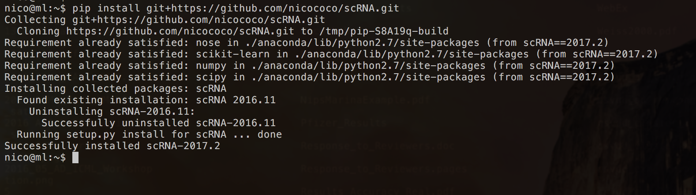

scRNA
=====
Python framework for single-cell RNA-seq clustering with special 
focus on transfer learning. This package contains methods for 
generating artifical data, clustering, and blending datasets (domain adaptation).

This software was written by Nico Goernitz, Bettina Mieth, Marina Vidovic, Alex Gutteridge. 

#### News
- First version that can be conveniently installed using the _pip install git+https://github.com/nicococo/scRNA.git_ 
command. Enjoy :)
- Command line script available

[create an anchor](#source-data)

Getting started
---------------

###Installation
We assume that Python >2.7 is installed and the _pip_ command is
callable from the command line. If starting from scratch, we recommend installing 
the [Anaconda](https://www.continuum.io/downloads) open data science 
platform (w/ Python 2.7) which comes with a bunch of most useful packages
for scientific computing.

The *scRNA* software package can be installed using the _pip install git+https://github.com/nicococo/scRNA.git_
command. After successful completion, three command line arguments will be 
available for **MacOS and Linux only**: 

* _scRNA-generate-data.sh_
* _scRNA-source.sh_ 
* _scRNA-target.sh_ 

Step 1: Installation with _pip install git+https://github.com/nicococo/scRNA.git_

###Simulating scRNA-seq Data 
_scRNA-generate-data.sh_

###Transfer Learning for scRNA-seq Data

####1. Setup the Source Dataset(#source-data)
-----------------
_scRNA-source.sh_ 

Input and output files:
 
|Command line arguments|Description                            |
|----------------------|:--------------------------------------|
|--fname      | Source data (TSV file)                         |
|--fgene-ids  | Source gene ids (TSV file)                     |
|--fout       | Result files will use this prefix              |
|--flabels    | (optional) Source cluster labels (TSV file)    |

Data pre-processing Gene/cell filtering arguments (SC3 inspired):

|Command line arguments|Description                            |
|----------------------|:--------------------------------------|
|--min_expr_genes      | (Cell filter) Minimum number of expressed genes (default 2000)", default=2000, type=int) |
|--non_zero_threshold  | (Cell/gene filter) Threshold for zero expression per gene (default 1.0)|
|--perc_consensus_genes| (Gene filter) Filter genes that coincide across a percentage of cells (default 0.98) |
|--no-cell-filter      | Disable cell filter |
|--no-gene-filter      | Disable gene filter |
|--no-transform        | Disable log2(x+1) data transformation |

Test settings: The software will test all values specified in cluster-range
and store results separately.

|Command line arguments|Description                            |
|----------------------|:--------------------------------------|
|--cluster-range | Comma separated list of clusters (default 6,7,8) |

These are NMF related parameters:

|Command line arguments|Description                            |
|----------------------|:--------------------------------------|
|--nmf_alpha    | Regularization strength (default 1.0)|
|--nmf_l1       | L1 regularization impact [0,1] (default 0.75)|
|--nmf_max_iter | Maximum number of iterations (default 4000)|
|--nmf_rel_err  | Relative error threshold must be reached before convergence (default 1e-3)|

Additional commands:

|Command line arguments|Description                            |
|----------------------|:--------------------------------------|
|--no-tsne  | Do not plot t-SNE plots as they can be quite time consuming |

####2. Target Dataset Clustering 
-----------------
_scRNA-target.sh_ 

Input and output files: 

|Command line arguments|Description                            |
|----------------------|:--------------------------------------|
|--src-fname  | Source *.npz result filename from Step 2       | 
|--fname      | Target data (TSV file)                         |
|--fgene-ids  | Target gene ids (TSV file)                     |
|--fout       | Result files will use this prefix              |
|--flabels    | (optional) Target cluster labels (TSV file)    |

Data pre-processing Gene/cell filtering arguments (SC3 inspired):

|Command line arguments|Description                            |
|----------------------|:--------------------------------------|
|--min_expr_genes      | (Cell filter) Minimum number of expressed genes (default 2000)", default=2000, type=int) |
|--non_zero_threshold  | (Cell/gene filter) Threshold for zero expression per gene (default 1.0)|
|--perc_consensus_genes| (Gene filter) Filter genes that coincide across a percentage of cells (default 0.98) |
|--no-cell-filter      | Disable cell filter |
|--no-gene-filter      | Disable gene filter |
|--no-transform        | Disable log2(x+1) data transformation |

SC3-specific distances and transformations:

|Command line arguments|Description                            |
|----------------------|:--------------------------------------|
|--sc3-dists  |(SC3) Comma-separated MTL distances (default euclidean) |
|--sc3-transf |(SC3) Comma-separated transformations (default pca) |

Test settings: The software will cluster any combination of the cluster-range
and mixtures and store results separately.

|Command line arguments|Description                            |
|----------------------|:--------------------------------------|
|--cluster-range | Comma separated list of clusters (default 6,7,8) |
|--mixtures | Comma separated list of convex combination src-trg mixture coefficient (0.=no transfer, default 0.0,0.1,0.2)| 

Additional commands:

|Command line arguments|Description                            |
|----------------------|:--------------------------------------|
|--no-tsne  | Do not plot t-SNE plots as they can be quite time consuming |

