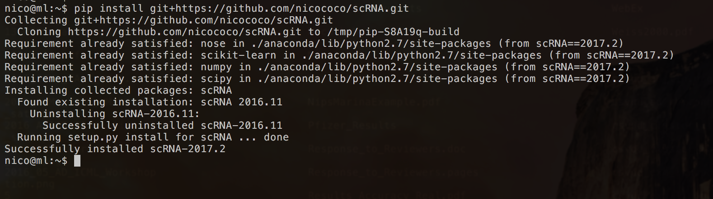
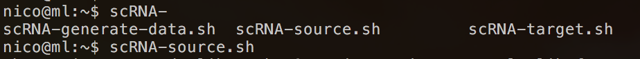
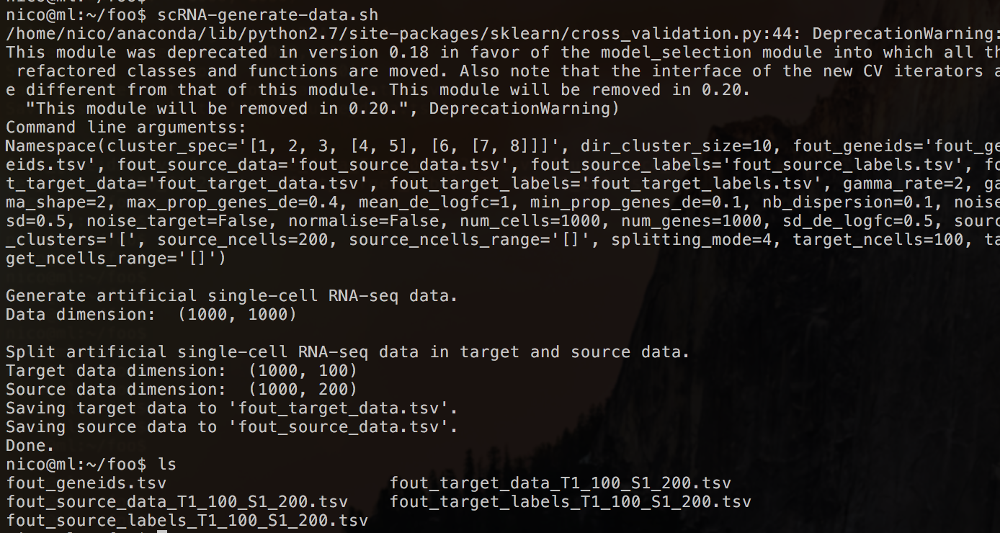
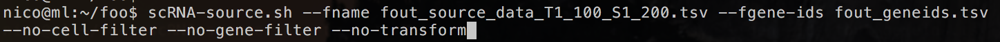
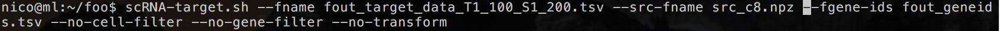
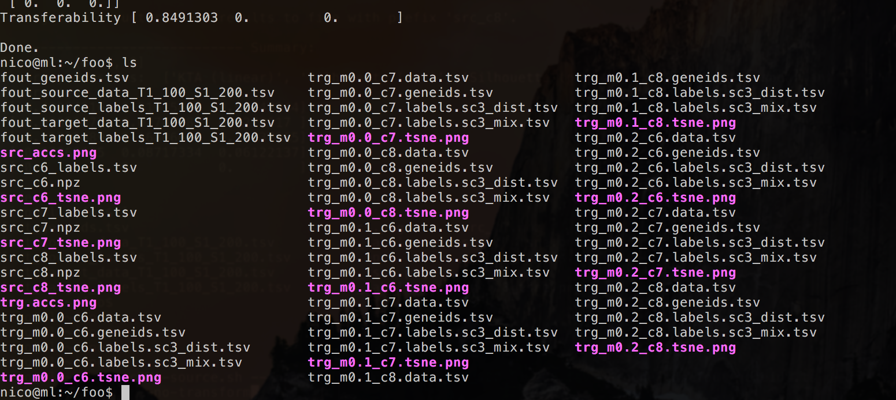

scRNA
=====
Python framework for single-cell RNA-seq clustering with special 
focus on transfer learning. This package contains methods for 
generating artificial data, clustering, and transfering knowledge
from a source to a target datasets.

This software was written by Nico Goernitz, Bettina Mieth, Marina Vidovic, Alex Gutteridge. 

#### News
* (2019.08) Added Python 3 support (scRNA no longer supports Python 2)
* (2019.08) Finalized version
* (2017.02) Added Travis-CI
* (2017.02) Added string label support
* Simple example [available](#example)
* [Website](http://nicococo.github.io/scRNA/) is up and running
* [Wiki](https://github.com/nicococo/scRNA/wiki) with detailed information (e.g. command line arguments)
* Please report [Bugs](https://github.com/nicococo/scRNA/issues) or other inconveniences
* scRNA can now be conveniently installed using the _pip install git+https://github.com/nicococo/scRNA.git_ 
command (see [Installation](#installation) for further information)
* Command line script available

Getting started
---------------

### Installation
We assume that Python is installed and the _pip_ command is
callable from the command line. If starting from scratch, we recommend installing 
the [Anaconda](https://www.continuum.io/downloads) open data science 
platform (w/ Python 3) which comes with a bunch of most useful packages
for scientific computing.

The *scRNA* software package can be installed using the _pip install git+https://github.com/nicococo/scRNA.git_
command. After successful completion, three command line arguments will be 
available for **MacOS and Linux only**: 

* _scRNA-generate-data.sh_
* _scRNA-source.sh_ 
* _scRNA-target.sh_ 

### Example 
**Step 1**: Installation with _pip install git+https://github.com/nicococo/scRNA.git_

**Step 2**: Check the scripts

**Step 3**: Create directory /foo. Go to directory /foo. Generate some artificial data
by simply calling the _scRNA-generate-data.sh_ (using only default parameters).

This will result in a number of files:
* Gene ids
* Source- and target data
* Source- and target ground truth labels

**Step 4**: NMF of source data using the provided gene ids and source data. Ie. we want
 to turn off the cell- and gene-filter as well as the log transformation.
 You can provide source labels to be used as a starting point for NMF. If not those labels
 will be generated via NMF Clustering.
Potential problems:
* If a ''Intel MKL FATAL ERROR: Cannot load libmkl_avx.so or libmkl_def.so.''
occurs and Anaconda open data science platform is used, then use _conda install mkl_ first.
* Depending on the data and cluster range, this step can take time. However, you can
 speed up the process by tuning off the t-SNE plots using the _--no-tsne_ command 
 (see [Wiki](https://github.com/nicococo/scRNA/wiki) for further information)

This will result in a number of files:
* t-SNE plots (.png) for every number of cluster as specified in the --cluster-range argument (default 6,7,8)
* Output source model in .npz format for every number of cluster as specified in the --cluster-range argument (default 6,7,8)
* A summarizing .png figure
* True cluster labels - either as provided from user or as generated via NMF Clustering - (and corresponding cell id) in .tsv format for every number of cluster as specified in the --cluster-range argument (default 6,7,8)
* Model cluster labels after NMF (and corresponding cell id) in .tsv format for every number of cluster as specified in the --cluster-range argument (default 6,7,8)

**Step 5**: Now, it is time to cluster the target data and transfer knowledge from the source model to our target data. Therefore, we need to
choose a source data model which was generated in **Step 4**. In this example, we will 
pick the model with 8 cluster (*src_c8.npz*).

* Depending on the data, the cluster range and the mixture range, this step can take a long
time. However, you can  speed up the process by tuning off the t-SNE plots using the _--no-tsne_ command 
(see [Wiki](https://github.com/nicococo/scRNA/wiki) for further information)

Which results in a number of files (for each value in the cluster range).
* Predicted cluster labels after transfer learning (and corresponding cell id) in .tsv format for every number of cluster as specified in the --cluster-range argument (default 6,7,8)
* t-SNE plots with predicted labels (.png)
* Data and gene ids in .tsv files

In addition there is a summarizing .png figure of all accs and a t-SNE plot with the real target labels, if they were provided.

Command line output shows a number of results: unsupervised and supervised (if no ground truth labels 
are given this will remain 0.) accuracy measures.

